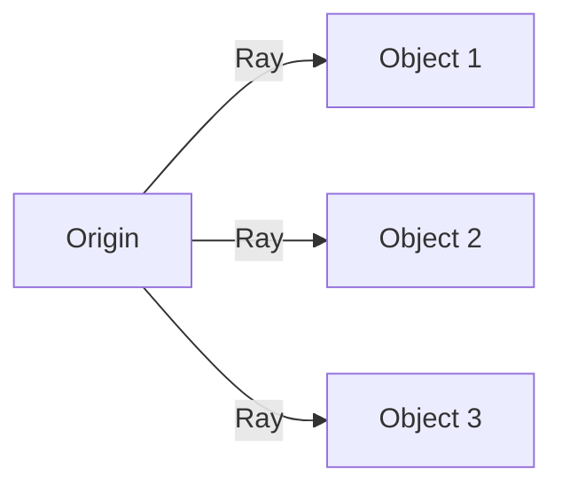

import { Callout, Steps, Step } from "nextra-theme-docs";

# Raycasting Approach

In the initial stages of developing the traversal system for Marvel's Spider-Man, the team at Insomniac Games explored using raycasts to find suitable attach points for the swinging mechanic. Raycasting is a common technique used in game development to detect collisions and intersections between objects in a virtual environment.

## How Raycasting Works

Raycasting involves casting a ray from a specific origin point in a given direction and checking for intersections with objects in the scene. In the context of the swinging mechanic, the idea was to use an array of raycasts to comb the environment and find potential attach points for the swing lines.

## Limitations of Raycasting

While raycasting seemed like a straightforward approach, the team encountered several limitations that ultimately led them to explore alternative methods:

1. **Insufficient resolution**: The line lengths in the game often exceeded 50 meters, and even with a respectable density of raycasts, there were significant gaps of up to 20 meters at full range. This resulted in missing small objects like flagpoles and radio towers, as well as large sections of buildings.

2. **Difficulty detecting corners**: Corners often make for optimal swing points, but raycasts struggled to find these positions due to the resolution problem.

3. **Inability to hit objects without collision**: Raycasts can only detect objects that have collision geometry. This posed challenges when dealing with objects like trees in areas such as Central Park.

4. **Performance concerns**: Performing collision checks for the numerous potential attach points found by raycasts could be costly in terms of performance, especially when processing dozens of points simultaneously.

<Callout type="warning">
Relying solely on raycasts for finding attach points in a complex urban environment like New York City proved to be insufficient and problematic.
</Callout>

## Moving Beyond Raycasting

Recognizing the limitations of raycasting, the team at Insomniac Games decided to explore alternative approaches for finding and selecting swing points. This led them to develop a more sophisticated [markup-based approach](/swing-point-selection/markup-based-approach) that allowed for greater control, flexibility, and performance.

By leveraging the lessons learned from the raycasting experiments, they were able to create a robust system that could handle the complexities of the game's traversal mechanics and deliver a satisfying swinging experience for players.