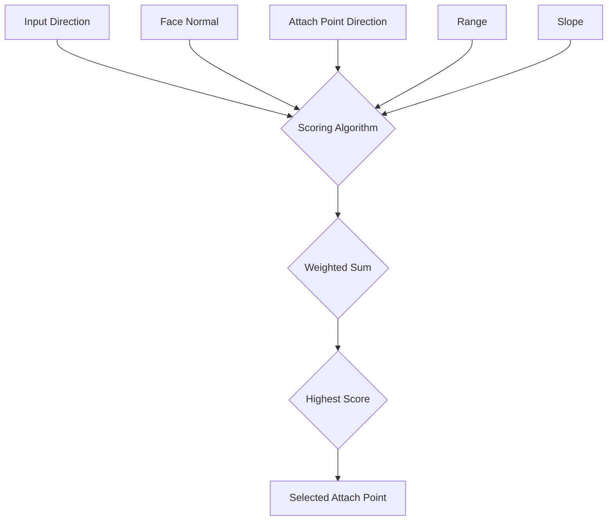

import { Callout, Steps, Step } from "nextra-theme-docs";

# Scoring and Selection

Once we have generated a field of potential swing points across the markup faces, we need to decide which point will be the best choice for the current frame. This is done by scoring each point and selecting the one with the highest score.

## Scoring Algorithm

The scoring algorithm is designed to fulfill the goal of translating the player's stick input into a point that moves the character in the desired direction. The algorithm takes into account several factors:

<Steps>
### Step 1: Input Direction and Face Normal

- Compare the input direction to the face normal.
- Swinging parallel to the face is preferred.
- Snap points to edges when nearby to provide the player with the most control.
- Use the best normal available on the entire sweep of the corner for score calculation.
- Give corners a bonus when turning if the corner helps make the turn.

### Step 2: Input Direction and Attach Point Direction

- Calculate the angle between the input direction and the direction of the attach point.
- Score the delta between these two angles.

### Step 3: Range

- Look for points that match the ideal line length.
- Score falls off as the point deviates from the ideal length in either direction.

### Step 4: Slope

- Apply a similar falloff method for slope as the angle moves away from the ideal.

### Step 5: Weighted Sum

- Perform a weighted sum of all the factors.
- The point with the highest score wins and becomes the attach point for the current frame.
</Steps>

<Callout type="info">
The weights for each factor in the scoring algorithm can be tuned to adjust the swinging behavior and make it feel more responsive to player input.
</Callout>

## Visualization

In-game debug information can be displayed to visualize the scoring process:

- Blue boxes represent the markup volumes.
- Floating text above each point shows its score.

This debug information is useful for understanding why one point is chosen over another and for tuning the scoring weights to achieve the desired swinging feel.

By combining all these factors and selecting the point with the highest score, we ensure that the player's input is translated into a swing point that moves Spider-Man in the expected direction, providing a responsive and satisfying swinging experience.

For more information on how the selected attach point is used in the swinging mechanics, see the [Swinging Mechanics](/swinging-mechanics) section.